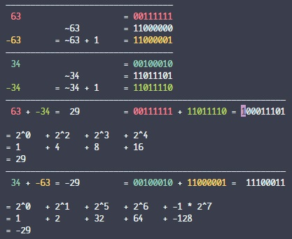

<div align="center">
    <h1>Two's Complement</h1>
    <p>Shows the process of summation of numbers using their Two's Complement.</p>
    
</div>

## Usage

```shell
pip3 install -r requirements.txt
python3 main.py
```
